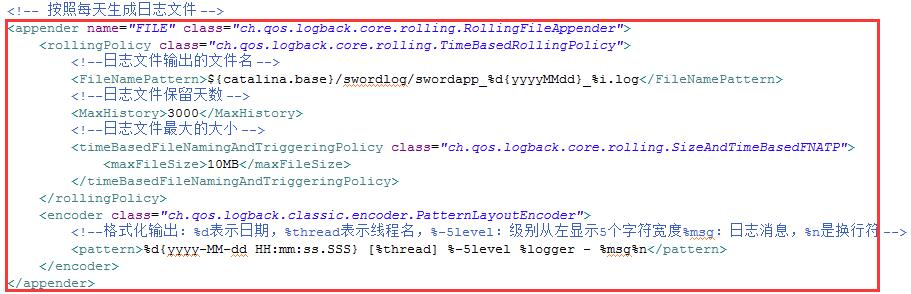

版本说明  
==========================
## 0.9.6
Released：2015.11.9

**Important:**

- POM文件中去掉了默认对fileupload的依赖
- 分别修改war包、jar包的artifactId为sword-room-war、sword-room-jar

**Fixed Issues:**

- 修复组织机构API中getRoleMembersByUuid返回数据类型不对的问题
- 修复侧边栏打开后首页垂直方向滚动条消失bug
- 修复字典保存时后台报错的bug
- 字典管理前台Service和后台API说明相关资源更新
- 基于framework提供的SwordExtraConfigUtils类，可支持properties文件的预加载，相关配置在sword.xml中追加
- 修复Grid组建updateRow方法控制台报错的bug

**Other Changes:** 
 
- sword-web升级到1.1.0
- 开发样例中菜单清理【删除开发样例中的ntkoOffice、DOM元素托、uploadAndGrid、搜索面板;调整网页播放器菜单到第三方组件下，调整treeDialog到组件组合下】

## 0.9.5
Released：2015.10.28

**Important:**

- 字典管理追加新的service，并在后台提供统一的静态API，以便业务使用，对应的字典表增加了新字段。
- 侧边栏相关:
  - 新添sid、body、urlCache、size属性
  - 删除close、allowClick属性
  - 新添setBody、open、destroy方法

**New Features:**

- Grid组件新增getCurPageData方法，新增onBeforeRenderRow、onAfterRenderRow、onAfterRenderTableBody事件，详细使用见API文档
- tool.js中新增uuid方法，获取32位uuid
- 新增配置工作时间模块，并提供工具类获取两个时间点之间的工作时间
- 新增登录日志模块（当前登录用户的登录日志历史信息、所有用户的登录成功日志信息、所有用户的登录失败日志信息）
- 新增单附件与多附件上传控件，后端自带断点续传，开发人员只需关心附件的ID即可（之前沈峤做的附件上传只支持后端断点上传文件，前端部分无法使用）

**Fixed Issues:**

- 修正了侧边栏通过远程url加载时双向绑定bug
- 修正了grid组件数据为0条且不带分页栏时，appendRow不生效问题
- 修正了组织机构部门树只能显示第一层级，无法显示子部门问题
- 解决SQLServer中open为关键字部门树无法显示的问题
- 解决了侧边栏组件内容中包含tab页时，tab页签切换不生效bug

**Other Changes:**  

- sword-web升级到1.0.4

## 0.9.4
Released：2015.9.22

**Important:**

- Sword-log.xml修改，以前的配置，生成的文件大小超过10M也会继续增长，不能自动生成新的文件（内容可从war中复制）

- 废弃cs-dialog、cs-single-upload、cs-file-upload指令
- Gird通过URL动态取数据时，往后端传的的参数pageNumber改为curPage(使用Page.java不影响)
- 废除Grid组件的realSort属性（通过URL获取数据时自动后端排序，静态数据时自动对静态数据排序，对原有代码不影响）
- 废除Grid组件的setData(用reload方法替代)、setConfig、extend方法
- 废弃Grid组件的formData属性，换由queryParam代替

**New Features:**

- Dialog组件支持URL模板的双向绑定，在Config参数中新增$compile、$scope参数
- 新增sword/formContainer供新打开页面使用，例如sword/formContainer#doc/uuid
- 首页的ng-router替换为ui-router
- 增加SwordOrgUtils.getRoleAPI().getRoleMembersByUuid方法，提供缓存功能
- grid增加了appendRow、deleteRow、updateRow、getChanges,reload方法，Grid config新增queryParam属性用于表格查询
- 新增SwordDateUtils、SwordStringUtils后端工具类

**Fixed Issues:**

- 修改了Scheduler组件所需的数据表，以及监控采集设置中的采集和告警所需数据表
- 修复了QC中新提出的问题

**Other Changes:**  

- 字典管理前端UI调整
- grid组件把所有私有方法封装了起来，另外所有下划线开头的属性和方法都不建议使用
- modules中引入ckeditor 4.5.3版本，可以使用PDModuleDir/ckeditor/ckeditor引入

**0.9.3 upgrade to 0.9.4:**

0. 删除pom文件中的sword-framework依赖，新增sord-web 1.0.3版本的依赖
1. 先执行maven clean、project clean并Refresh项目，然后执行maven package【勾上Skip texts】命令
2. 删除项目中的临时升级文件
3. 用target目录war下的sword-log.xml,sword.xml替换掉项目中的此文件
4. 运行0.9.4.sql中的脚本文件
5. 项目中对于Gird组件如果没有使用Page.java，需要要将返回给Grid的数据中的key【pageNumber】修改为【curPage】
6. 如果使用到Grid组件的setData方法需要改用reload方法代替【reload的参数为Gird的config对象，其中id、placeAt等核心字段不生效】
7. 由于字典管理前端UI调整，需修改服务项字典的dict_type字段的值为simple【不修改不会对菜单处选择依赖服务造成影响，但会造成在字典管理中无法维护服务项】

## 0.9.3
Released：2015/8/31

**Important:**

- 废弃UserUtil类，UserUtil.getCurrentUserId()变更为SwordOrgUtils.getUserAPI().getCurrentUserUuid()
- SwordCacheUtils.get(Object key)变更为 SwordCacheUtils.get(Object key,Class<T> clazz)
- SwordCacheUtils.get(String poolName, Object key)变更为SwordCacheUtils.get(String poolName, Object key,Class<T> clazz)

**New Features:**

- 新增快捷菜单功能
- 新增组织机构相关API，可通过SwordOrgUtils调用
- 新增系统监控中监控采集设置和告警日志监控，需要在sword.xml中增加Scheduler组件以及相关数据表

**Fixed Issues:**

- 修复QC 299号之前问题
- 解决达梦等国产数据库SQL兼容问题(comment列名称为关键字问题、别名不能加引号问题)

**Other Changes:**  

- swordframework升级到1.1.15

## 0.9.2
Released：2015/8/10

**New Features:**

- 新增换肤功能
- 菜单动态注入服务项
- 表格新增onSelectAll事件

**Fixed Issues:**

- 修复QC 260号之前问题

**Other Changes:**  

- swordframework升级到1.1.14
- 部门表中去除管理人员名称和管理人员编号字段，去除部门领导与部门领导编号字段，增加部门领导UUID字段，执行0.9.2.sql文件即可
- 字典管理中追加一列使用状态，替换创建人、修改人名称的显示内容。
- 去掉部门冻结功能，相应的去掉了高级中的冻结人员列表，在部门树上增加删除部门按钮

## 0.9.1
- 1.swordframework升级到1.1.12  
- 2.QC 225号之前问题处理
- 3.组织机构增加人员删除与部门删除功能
- 4.权限管理改名为资源管理;资源管理添加查找搜索功能。
- 5.资源权限过滤器和CSRF过滤器处理逻辑改为模糊匹配资源URL的方式
- 6.ztree添加右键菜单功能
- API修改记录(带@符号的变更可能会与旧版本不兼容)
grid
1@.config -> layout > format函数 直接接受当前行数据对象,去掉row属性
inputSelect
1.config -> key -> data 改为 children, 原参数仍可使用
2.config -> initData 不推荐使用, 改为使用对象函数dataInit(idArray)
3@.config -> onSelect 函数已废除, 统一改为使用callback
4.config -> selectNode 已废除, 组件本身具有选中目录节点功能, 无需额外设置
typeahead
1@.config -> filter 参数已废除, 组件内部根据数据源类型判断是否启用文本过滤
2@.config -> dataFormat 参数属性变更
a) field 更改为 name, 表示标题名
b) key 更改为 field, 表示字段名

## 0.9.0
- 1.swordframework升级到1.1.11										UPDATE
- 2.首页改版，界面风格统一											UPDATE  
- 3.QC 150号之前问题处理
- 4.升级fileupload到v0.10.0，改变调用方式，并修改sample中代码  
- 5.组织机构-人员表增加"直属领导"字段，增加组织日志表				NEW  
- 6.扩展ztree，增加toolbar、scroll配置段，具体参见ztree的example页面		NEW  
- 7.侧边栏组件升级，增加afterLoad事件回调、afterClose事件回调、内部增加destroy方法  
- 8.Dialog组件升级，增加url属性支持加载远程dom模板、afterLoad事件回调、afterClose事件回调、defaultClose属性（是否默认显示“关闭”按钮）  
- 9.组织机构增加org_log表，org_user表中增加direct_leader字段  
- 10.新加welcome页面  
- 11.功能资源表添加red_order字段  

## 0.8.3
1.修改$.ajax全局事件，延迟显示加载进度  
2.侧边栏组件优化  
4.组织机构的所有导入增加编号重复验证								NEW  
5.组织机构增加导入的日子查看模块									NEW  
6.修改$.ajax全局事件，延迟显示加载进度  
7.侧边栏组件优化  

## 0.8.2  
1.首页退出功能  													NEW  
2.swordframework升级到1.1.10										UPDATE
3.组织机构中所有表格的排序由当页排序调整为所有						NEW  
4.2015-6-8之前QC问题处理											BUG
5.登录页面样式更新												BUG
6.页面定制功能开发，目前只包含系统名称一项							NEW
7.ServiceResult的更新											UPDATE
8.权限管理，服务扫描支持选择权限目录								UPDATE
9.更改基础框架引入方式，在发布版本中去除基础框架的强依赖。			UPDATE
10.修改字典管理后台查询逻辑										UPDATE

## 0.8.1  
1.路由配置放入菜单中  
2.ztree样式修改  
3.前端组件API统一  
4.sword-framework由1.1.8升级到1.1.9  
5.权限配置部分提供选择后端service  
